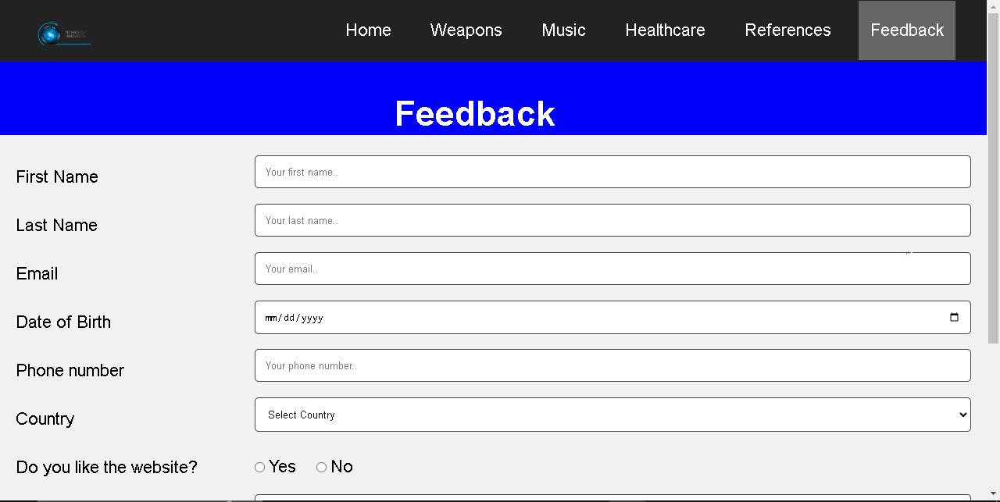

  

<h1 align="center">Technological Innovation Website</h1>

     <h4 align="center">This is a responsive Website designed for users interested in reading all the latest news related to Technology in various fields like
        Military Weapons, Healthcare and Music.
     </h4> 
       
  

-----------------------------------------
### Overview
This is a website about information on technological innovation in different fields like Military weapons, Music, Healthcare and latest news about technology is present on the home page. The first page is the Home page which consists of up-to-date news about current issues in technology. The next 3 pages give out information on technologies used in Weapons, Music and Healthcare respectively. References is present on the 5th page where citations of the sources are present. The overall feedback from the user is taken on the 6th page.

-----------------------------------------

### Features

* User-friendly and responsive interface using Flex
* The nav bar is well designed to navigate between all the pages
* The information is divided effectively among multiple pages, and a feedback form has been built to collect user comments in order to further improve the website in light of that feedback

-----------------------------------------

### Implementation
* Built with HTML, CSS and JavaScript
* Used Flex to make the website responsive across all the devices

-----------------------------------------

### Screenshots
* `Home Page`
  

 

 

* `Weapons Page`

 

 

* `User Feedback Page`

 

